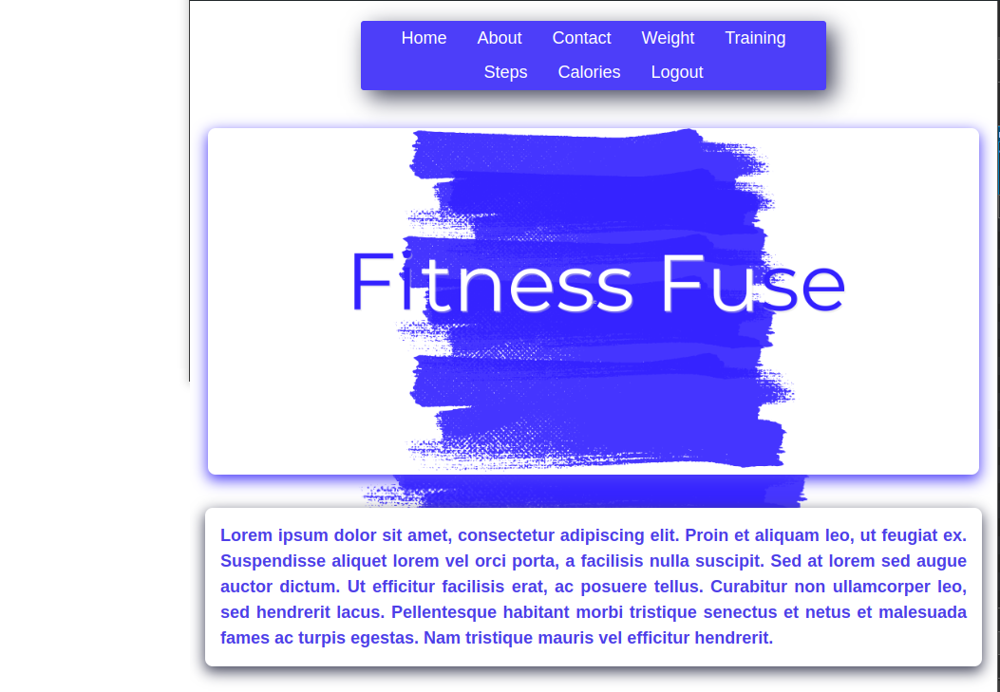
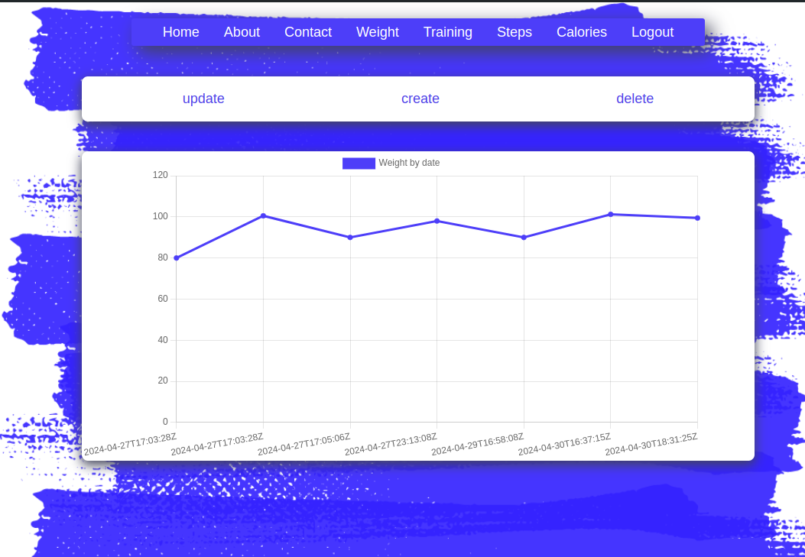
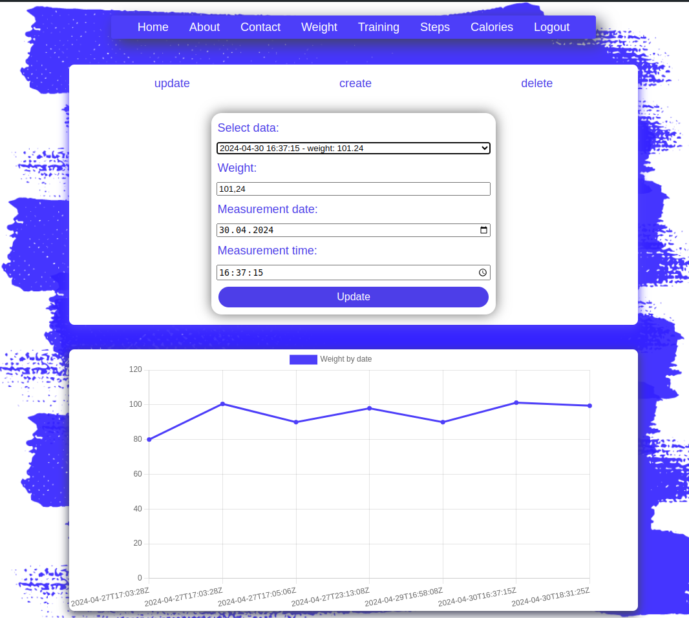
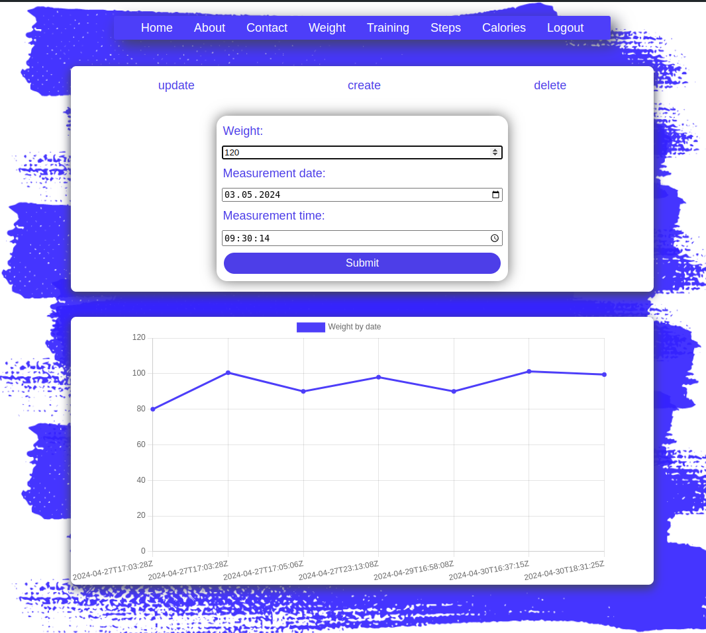
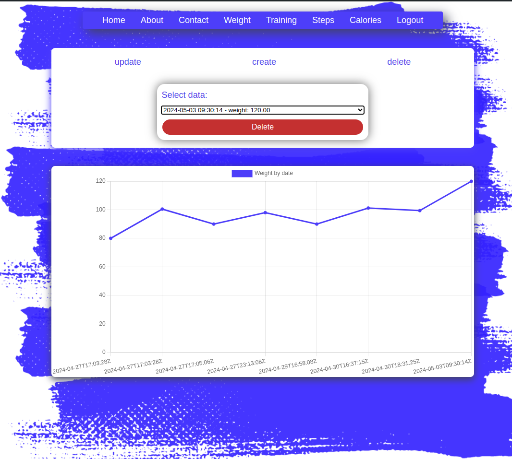

# FitnessFuseNode
Front part of FitnessFuse application
FitnessFuseNode app is calling the [FitnessFuseApp](https://github.com/LaskiKa/FitnessFuse)

To finish readme.md
Ongoing work

## Examples:
1. Home

2. Weight

3. Weight update

4. Weight create

5. Weight delete
